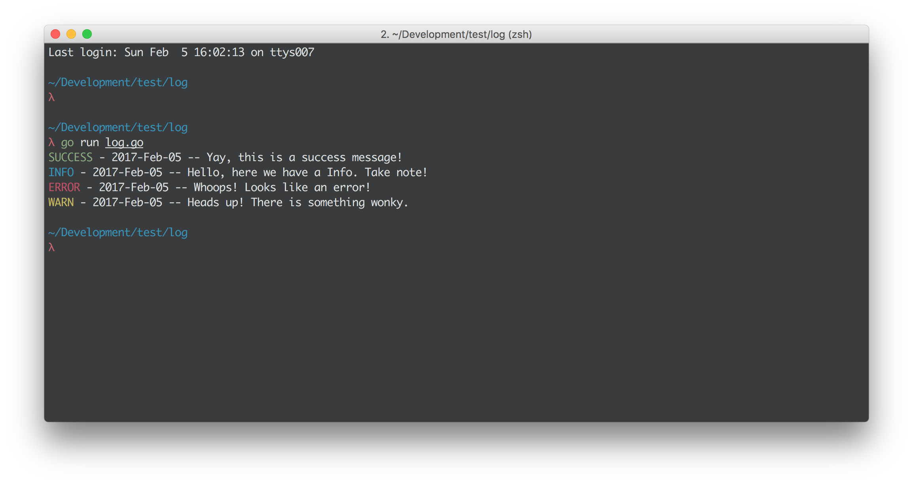

# Colog
> Colorful terminal logs

[](https://goreportcard.com/report/github.com/kevingimbel/colog) [](https://godoc.org/github.com/kevingimbel/colog) 

Create colorful logs in terminals. Wrapper around [github.com/fatih/color](https://github.com/fatih/color/).

### Example

```go
package main

import (
	"fmt"
	"github.com/kevingimbel/colog"
)

var logConfig = make(map[string]string)

// Assign the configuration inside the init function
// This is run before main
func init() {
	logConfig["TimeFormat"] = "2006-Jan-2"
	logConfig["LogFormat"] = "[%s][%s] -- %s"
}

func main() {
	// Create a new Logger with the config assigned above
	Log := colog.NewColog(logConfig)

	fmt.Println(Log.Success("Yay, this is a success message!"))
	fmt.Println(Log.Info("Hello, here we have a Info. Take note!"))
	fmt.Println(Log.Error("Whoops! Looks like an error!"))
	fmt.Println(Log.Warn("Heads up! There is something wonky."))
}
```



## API

You can find the API documentation on [godoc.org](https://godoc.org/github.com/kevingimbel/colog)

### `Colog` struct

```go
type Colog struct {
	LogFormat    string
	TimeFormat   string
	InfoLabel    string
	ErrorLabel   string
	WarnLabel    string
	SuccessLabel string
}
```

Default values:

```go
LogFormat    "[%s][%s] %s"
TimeFormat   "2006-Jan-2 15:04:05"
InfoLabel    "INFO"
ErrorLabel   "ERROR"
WarnLabel    "WARN"
SuccessLabel "SUCCESS"
```
